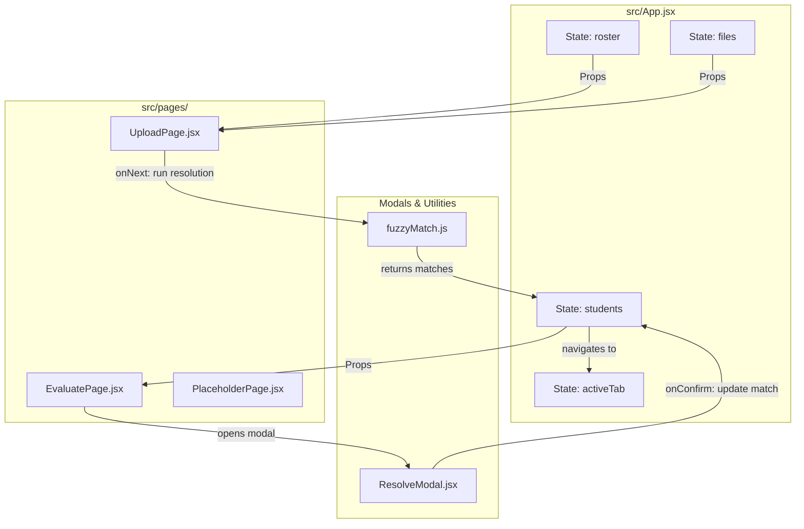

# Grading Assistant - Presentation & Architecture

This document structures potential feature additions, explains the application's current design decisions, and maps out the high-level architecture of the Grading Assistant prototype.

---

## 1. Potential Feature Additions

### Feature A: Side-by-Side OCR Corrective Editor
* **Rationale**: OCR engines operating on handwritten documents inevitably encounter noise (such as messy pen strokes, faded ink, or scanning artifacts). In cases of low-confidence matches or unmatched scripts, the grader needs an intuitive way to visually cross-reference the actual paper header with the parsed data to manually correct it.
* **What it is**: A side-by-side viewport modal that opens when a student is marked as "Unmatched" or has low match confidence. It displays a cropped region of the uploaded PDF containing the student's handwritten name/roll number next to a correction form.
* **Component Snippet**:
  ```jsx
  export function OcrCorrectiveEditor({ student, onSave, onClose }) {
    const [nameField, setNameField] = useState(student.ocr.ocr_name);
    const [rollField, setRollField] = useState(student.ocr.ocr_roll);

    return (
      <div style={{ display: 'flex', gap: 20, padding: 16, border: '1px solid #e5e7eb', borderRadius: 12 }}>
        {/* Visual Reference Panel */}
        <div style={{ flex: 1, display: 'flex', flexDirection: 'column', gap: 8 }}>
          <span style={{ fontSize: 12, fontWeight: 600, color: '#6b7280' }}>Visual OCR Crop Reference</span>
          <div style={{ border: '1px solid #d1d5db', borderRadius: 8, height: 110, display: 'flex', alignItems: 'center', justifyContent: 'center', background: '#f9fafb' }}>
            <span style={{ fontSize: 11, color: '#9ca3af' }}>[Rendered PDF Crop Segment: Page 1 Header]</span>
          </div>
        </div>

        {/* Editing & Form Panel */}
        <div style={{ flex: 1, display: 'flex', flexDirection: 'column', gap: 12 }}>
          <div>
            <span style={{ fontSize: 11, fontWeight: 600, color: '#9ca3af' }}>Correct Name</span>
            <Input value={nameField} onChange={setNameField} />
          </div>
          <div>
            <span style={{ fontSize: 11, fontWeight: 600, color: '#9ca3af' }}>Correct Roll Number</span>
            <Input value={rollField} onChange={setRollField} />
          </div>
          <div style={{ display: 'flex', justifyContent: 'flex-end', gap: 8, marginTop: 8 }}>
            <Button size="sm" onClick={onClose}>Cancel</Button>
            <Button size="sm" variant="primary" onClick={() => onSave(nameField, rollField)}>Save Correction</Button>
          </div>
        </div>
      </div>
    );
  }
  ```

### Feature B: LMS / Canvas Roster Sync
* **Rationale**: Manually exporting, formatting, and uploading CSV roster files is a friction point for educators. Directly querying LMS platforms saves time and prevents roster sync discrepancies.
* **What it is**: An OAuth-backed synchronization tool integrated into the **Upload** page, fetching class lists directly from platforms like Canvas, Blackboard, or Moodle, and populating the local roster state.
* **Component Snippet**:
  ```jsx
  export function LmsSyncConnector({ onSyncCompleted }) {
    const [syncing, setSyncing] = useState(false);

    const handleSync = async () => {
      setSyncing(true);
      // Simulate API query to Canvas LMS
      setTimeout(() => {
        const fetchedRoster = [
          { name: 'Arjun Sharma', roll: '2021CS001' },
          { name: 'Priya Nair', roll: '2021CS002' }
        ];
        onSyncCompleted(fetchedRoster);
        setSyncing(false);
      }, 1200);
    };

    return (
      <div style={{ padding: 14, border: '1px solid #bfdbfe', background: '#eff6ff', borderRadius: 10 }}>
        <p style={{ fontSize: 12, color: '#1e40af', marginBottom: 8 }}>Import class roster directly from your LMS portal.</p>
        <Button size="sm" variant="primary" disabled={syncing} onClick={handleSync}>
          {syncing ? 'Connecting to Canvas...' : 'Sync Canvas Course Roster'}
        </Button>
      </div>
    );
  }
  ```

### Feature C: Horizontal Question-by-Question Grading Interface
* **Rationale**: Grading papers cover-to-cover introduces grading fatigue and inconsistency. Horizontal grading—grading Q1 for all students, then Q2 for all students—ensures grading parameters remain strictly consistent across the entire batch.
* **What it is**: A dedicated panel displaying the answers to a specific question (e.g., Q1) sequentially for all students. Graders can view the cropped PDF response block and score it using the predefined rubric criteria.
* **Component Snippet**:
  ```jsx
  export function QuestionGradingPanel({ students, questionId, rubric, onUpdateScore }) {
    const [index, setIndex] = useState(0);
    const activeStudent = students[index];

    return (
      <Card>
        <div style={{ display: 'flex', justifyContent: 'space-between', marginBottom: 12 }}>
          <h4>Grading {questionId} ({index + 1} of {students.length})</h4>
          <span style={{ fontWeight: 600 }}>Student: {activeStudent.matched?.name || 'Unresolved'}</span>
        </div>
        <div style={{ display: 'grid', gridTemplateColumns: '2fr 1fr', gap: 16 }}>
          {/* Answer Preview */}
          <div style={{ border: '1px solid #e5e7eb', height: 300, background: '#fafafa', borderRadius: 8, padding: 12 }}>
            <span style={{ fontSize: 11, color: '#9ca3af' }}>[PDF Snippet representing answer bounds for {questionId}]</span>
          </div>
          {/* Scoring panel */}
          <div style={{ display: 'flex', flexDirection: 'column', gap: 10 }}>
            <Label>Rubric Criteria</Label>
            {rubric.criteria.map(c => (
              <Button key={c.points} size="sm" onClick={() => onUpdateScore(activeStudent.id, questionId, c.points)}>
                {c.label} (+{c.points} pts)
              </Button>
            ))}
            <div style={{ display: 'flex', gap: 8, marginTop: 'auto' }}>
              <Button size="sm" disabled={index === 0} onClick={() => setIndex(i => i - 1)}>Prev</Button>
              <Button size="sm" disabled={index === students.length - 1} onClick={() => setIndex(i => i + 1)}>Next</Button>
            </div>
          </div>
        </div>
      </Card>
    );
  }
  ```

---

## 2. Web-Application Technical Details

### UI Component Libraries
* **Are we using Material UI?**
  No. The application is built using custom components styled with **Vanilla JS inline objects** (located in `src/components/UI.jsx`).
* **Why this choice?**
  * **Zero Dependency Overhead**: Avoids importing large UI bundles (like `@mui/material` and `@emotion/react`), resulting in a lightweight, lightning-fast compilation footprint.
  * **Encapsulated Styles**: Custom inline objects isolate components from global stylesheets, preventing conflicts.
  * **Icons**: We utilize `lucide-react` for flexible, modern SVG icons.

---

### Local Application State Variables

The following state parameters coordinate user actions and data pipelines:

| Component | State Variable | Data Type | Description |
| :--- | :--- | :--- | :--- |
| **`App`** (`src/App.jsx`) | `activeTab` | `string` | Tracks which dashboard tab is currently rendered (`build` \| `annotate` \| `rubrics` \| `upload` \| `evaluate` \| `admin`). |
| | `roster` | `array` | List of student roster profiles loaded from CSV or inputs. Structure: `[{ name, roll }]`. |
| | `files` | `array` | Array of mock/selected student PDF file names and sizes. Structure: `[{ name, size }]`. |
| | `pagesPerStudent` | `number` | The setting used to segment a combined PDF batch into single student folders. |
| | `students` | `array` | The main repository of evaluation records. Updated upon batch fuzzy resolution. |
| **`UploadPage`** (`src/pages/UploadPage.jsx`) | `rosterLoaded` | `boolean` | Flag to display either the drag-and-drop CSV box or the student roster editor table. |
| **`Dropzone`** (`src/pages/UploadPage.jsx`) | `drag` | `boolean` | Governs the active CSS border highlight during files-drag-over events. |
| **`EvaluatePage`** (`src/pages/EvaluatePage.jsx`) | `modalId` | `number \| null` | Stores the active student ID whose identity needs manual resolution in `ResolveModal`. |
| | `selected` | `Set` | Stores list of student IDs selected for batch evaluation checkmarks. |
| **`ResolveModal`** (`src/components/ResolveModal.jsx`) | `search` | `string` | Query string typed by user to filter roster candidates. |
| | `selected` | `string \| null` | Roll number identifier representing the currently checked candidate. |

---

## 3. High-Level Architectural Summary

The system acts as a pipeline that takes raw input rosters/PDFs, resolves identities, and loads grading scores.



### Components and Flows
1. **App**: Orchestrates page visibility and state. Passing state mutation functions as callbacks (`onRosterChange`, `onStudentUpdate`, `onNext`).
2. **Navbar**: Global menu button bar mapped to state changes in `activeTab`.
3. **UploadPage**: Gathers files and student lists. Contains CSV parser subcomponents. Triggers matching engine `resolveAll` inside `fuzzyMatch.js` upon completion.
4. **EvaluatePage**: Lists students sorted by unmatched status. Provides tooltips displaying OCR confidence.
5. **ResolveModal**: Interactive matching editor loaded if a grader manually selects a line item. It compares the script's raw OCR metadata with best matches filtered via search.
